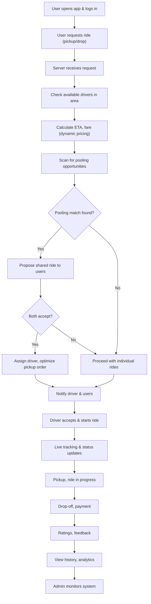

# AutoSharePolling: Real-Time Ride-Sharing Platform Proposal

---

## 1. Problem Statement

Urban transportation faces persistent challenges: unpredictable wait times, inefficient driver allocation, static pricing, and lack of real-time responsiveness to traffic and demand. Existing ride-hailing platforms often fail to optimize routes, pricing, and ride matching dynamically, leading to wasted resources, higher costs, and suboptimal user/driver experiences.

---

## 2. Solution

AutoSharePolling proposes a next-generation, real-time ride-sharing platform. By leveraging advanced algorithms for dynamic ride assignment, real-time route optimization, and intelligent pricing, the system aims to maximize efficiency, minimize wait times, and deliver a seamless experience for users, drivers, and administrators.

---

## 3. Existing System (Rapido, Uber, Ola, etc.)

- **Core Features:**
  - Real-time ride booking and tracking
  - Fare estimation and multiple payment options
  - Ratings, reviews, and in-app support
  - Ride scheduling and cancellation
  - Basic ride pooling (in some apps)
  - Admin dashboards for monitoring
- **Limitations:**
  - Pooling and matching are often not fully dynamic or optimized in real time
  - Route optimization may not always account for live traffic or shared ride detours
  - Surge pricing is sometimes opaque or delayed
  - Limited transparency in algorithmic decision-making

---

## 4. My Idea (Description)

AutoSharePolling will introduce a fully real-time, intelligent ride-sharing system with:
- **Advanced Dynamic Ride Pooling:** Instantly matches users with similar routes, optimizing for minimal detour and time, and allowing shared rides if all parties consent.
- **Real-Time Route Optimization:** Continuously updates routes and ETAs using live traffic data, optimizing pickup/drop-off order for shared rides.
- **Transparent Dynamic Pricing:** Adjusts fares in real time based on demand, supply, and traffic, with clear explanations to users.
- **Smart Matching:** Assigns the best driver using real-time location, ETA, and driver preferences.
- **User/Driver Experience:** In-app chat, SOS, wallet, promotions, and analytics, all updated in real time.

---

## 5. Proposed Solution: Features & Real-Time Algorithms

### A. Real-Time Ride Assignment (Matching)
- **Algorithm:** Greedy Nearest-Driver Assignment (with ETA calculation)
- **How:** When a user requests a ride, the system finds all available drivers within a radius, calculates ETA using live traffic, and assigns the driver with the shortest ETA. For batch requests, a bipartite matching (Hungarian Algorithm) can be used.

### B. Dynamic Ride Pooling (Shared Ride Matching)
- **Algorithm:** Real-Time Pooling Matcher
- **How:** Continuously scans for ride requests with similar drop locations and overlapping pickup times. If a match is found, proposes a shared ride to both users. If both accept, updates ride records, assigns a driver, and optimizes pickup/drop-off order (using TSP or heuristic).

### C. Dynamic Pricing (Surge Pricing)
- **Algorithm:** Real-Time Demand-Supply Ratio with Surge Multiplier
- **How:** Monitors demand and supply in each zone. If demand exceeds supply, applies a surge multiplier to fares. Updates in real time as conditions change.

### D. Route Optimization
- **Algorithm:** Real-Time Shortest Path (Dijkstra, A*, or Directions API)
- **How:** Uses a routing API or in-house algorithm to calculate the optimal route and ETA, continuously updating as traffic conditions change. For shared rides, optimizes pickup and drop-off order for minimal detour and time.

### E. ETA Prediction
- **Algorithm:** Live ETA Calculation (using traffic data)
- **How:** Continuously updates ETA for users and drivers using live location and traffic feeds.

### F. Live Tracking & Notifications
- **Algorithm:** WebSocket-based Real-Time Updates
- **How:** Uses WebSockets to push live location, ride status, and notifications to users and drivers instantly.

---

## 6. Full System Flowchart

